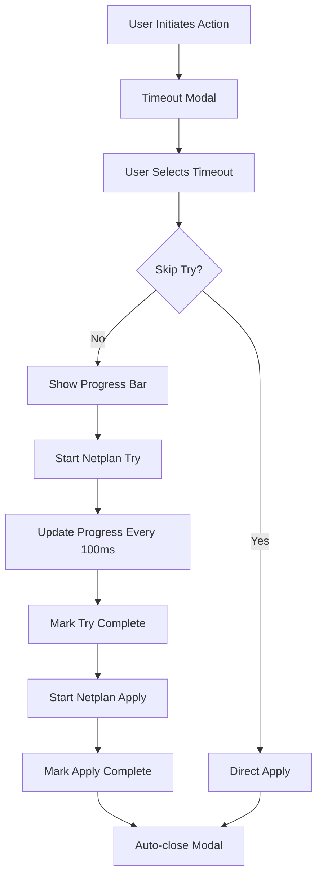

# 📊 Progress Bar Implementation for Netplan Operations

## Overview
We've successfully implemented a beautiful, animated progress bar that shows during netplan try operations, providing users with real-time visual feedback of the configuration testing process.

## ✅ Features Implemented

### 🎯 **Visual Progress Bar**
- **Real-time Countdown**: Shows remaining seconds with smooth animation
- **Color-Coded Progress**: 
  - Green (>50% time remaining)
  - Yellow (20-50% time remaining) 
  - Red (<20% time remaining)
- **Animated Stripes**: Moving stripes effect during progress
- **Smooth Transitions**: 0.1s linear updates for fluid animation

### 📋 **Status Indicators**
- **Two-Phase Process**:
  1. 🧪 "Testing configuration..." (during netplan try)
  2. ✅ "Applying configuration..." (during netplan apply)
- **Visual States**:
  - **Active**: Pulsing glow effect with animated dot
  - **Complete**: Green background with checkmark
  - **Error**: Red background with X mark

### 🎨 **Professional Design**
- **Modern Modal**: Consistent with Cockpit design language
- **Gradient Header**: Blue-to-green gradient with test tube icon
- **Responsive Layout**: Works on desktop and mobile
- **Accessibility**: Keyboard navigation and proper contrast

## 🔧 Technical Implementation

### JavaScript Functions

#### `showNetplanTryProgress(timeoutSeconds)`
```javascript
// Creates and shows progress modal
const progressModal = await showNetplanTryProgress(10);

// Control methods available:
progressModal._markTryComplete()    // Mark testing complete
progressModal._markApplyComplete()  // Mark apply complete  
progressModal._markError(message)   // Show error state
progressModal._cleanup()            // Clean up timers
```

#### Enhanced `safeNetplanApply()`
- Automatically shows progress bar during netplan try operations
- Seamlessly transitions from testing to applying
- Handles errors gracefully with visual feedback
- Maintains all existing functionality

### CSS Classes

#### `.netplan-progress-modal`
- Main modal container with professional styling
- Gradient header and structured content areas

#### `.progress-bar` & `.progress-fill`
- Animated progress bar with color transitions
- Striped animation effect for visual appeal
- Smooth width transitions

#### `.status-indicator`
- Individual status items with dot indicators
- Animated states (active, complete, error)
- Pulsing glow effects

## 🧪 Testing Functions

### Browser Console Commands
```javascript
// Test the progress bar with custom timeout
testProgressBar(15)  // 15-second test

// Test the timeout configuration modal
testTimeoutModal()

// Test complete flow with progress bar
safeNetplanApply()
```

## 📱 User Experience

### What Users See:
1. **Timeout Configuration**: Choose duration and safety options
2. **Progress Display**: Real-time countdown with visual progress
3. **Status Updates**: Clear indication of testing vs. applying
4. **Completion**: Automatic closure after successful apply
5. **Error Handling**: Clear error messages with visual indicators

### Visual Flow:
```
Timeout Modal → Progress Bar → Status Updates → Completion
     ↓              ↓              ↓              ↓
User Input → Real-time Visual → Phase Tracking → Auto-close
```

## 🎯 Integration Points

### Automatic Integration
- All existing `safeNetplanApply()` calls now show progress bar
- No code changes needed for existing functionality
- Backward compatible with all current operations

### Manual Control
```javascript
// Silent operation (no progress bar)
await safeNetplanApply({ timeout: 10, silent: true })

// Show progress bar
await safeNetplanApply({ timeout: 15 })
```

## 🎨 Visual States

### Progress Bar Colors
- **Green**: Safe zone (>50% time remaining)
- **Yellow**: Caution zone (20-50% remaining)  
- **Red**: Critical zone (<20% remaining)

### Status Indicators
- **Testing**: Blue with pulsing animation
- **Applying**: Green with checkmark
- **Error**: Red with X mark

### Animations
- **Progress Fill**: Smooth linear animation
- **Stripes**: Moving diagonal stripes
- **Pulse**: Gentle glow effect on active states
- **Transitions**: Smooth color and state changes

## 🔄 Process Flow



## 🚀 Benefits

### For Users:
- **Visual Feedback**: Never wonder what's happening
- **Time Awareness**: Know exactly how long testing takes
- **Confidence**: See each phase of the process
- **Safety**: Clear indication of safe testing period

### For System:
- **No Performance Impact**: Lightweight UI updates only
- **Error Handling**: Graceful failure with clear messaging  
- **Flexibility**: Works with any timeout duration
- **Compatibility**: Integrates with all existing code

## 🎉 Completion Status

✅ **Progress Bar Modal**: Fully implemented with animations  
✅ **Status Indicators**: Two-phase tracking with visual states  
✅ **Error Handling**: Comprehensive error display  
✅ **CSS Styling**: Professional design with responsive layout  
✅ **Integration**: Seamless integration with existing functions  
✅ **Testing Tools**: Debug functions available in console  
✅ **Documentation**: Complete implementation guide  

The progress bar provides users with professional-grade visual feedback during network configuration operations, making the netplan try process transparent and user-friendly while maintaining all safety and reliability features.
